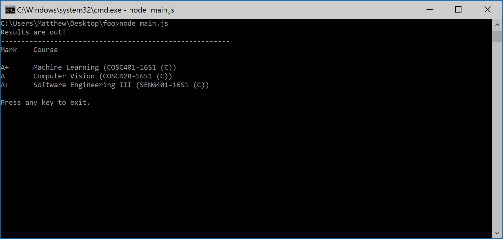

# BUGGER
<i>(**B**ig **U**gly **G**etter **G**adget for **E**lucidating **R**esults)</i>

------------------------
I got sick of waiting for my University of Canterbury Exam results, so this does the waiting for you. Waits for and retreives exam results when they become avalible. It does this by checking the results page every 5mins (configurable).



#### Installing
```shell
git clone https://github.com/mrkno/bugger.git Bugger
npm install
```

#### Running
```shell
node main.js
```
or
```shell
npm start
```

#### The Code
- Is it ugly? Yes.
- Does it work? Probably not now.
- Do I care? Better question: how much chocolate will you send me?
- Does the university support the grotesque reverse engineering of their SSO? I doubt it.
- Tests? Tested in production. It Worked™!
- License? MIT.
